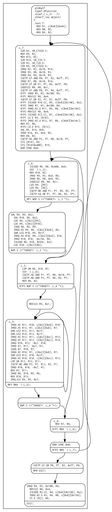

# Balsn CTF 2020 Writeup - The Danger of Google's Omnipotence

Category: Reverse

Solved: 2/490

[Original Link](https://colab.research.google.com/drive/1GJOkWpFqG-RQvNHeNwQf2F8C6UFQF70C?usp=sharing)

## Overview

The function f performs matrix multiplication in $M_{256}(\mathbb{F}_{7^3})$. With given $A, B \in M_{256}(\mathbb{F}_{7^3})$ and power $k\in\mathbb{N}$, f calculates $A\cdot B^k$. 

[Solution Link](https://colab.research.google.com/drive/1VR2E7cAO_XBQRWkqma6HPpudjQY9HLmv?usp=sharing)

[Source and Compile Link](https://colab.research.google.com/drive/1MRo77IDvEJB3FkEivpme71y3g-24aCku?usp=sharing)

## Solution

The `buffer_dict` is used to handle the different compute capability of Nvidia GPUs. On google colab, user might get Nvidia K80s, T4s, P4s or P100s [1]. We cannot select the type of GPUs, so we need to include versions of `cubin`.

To findout the content of the `cubin`, `nvdisasm` provided by Nvidia is recommanded to get the assembly code of the `cubin`. You could generate control flow graph with `nvdisasm -bbcfg a.cubin | dot -obbcfg.png -Tpng`. Also, you can find the instrcution tables of Nvidia architectures here [2]. These tools could help to recover the semantics of the program.

It is a parallel matrix multiplication algorithm on GPU (`.L7`). The dependent blocks was loaded into shared memory first with `LDS` instrcution. Then, finite field arithmetic was parallel calculated. 

To obtain the original $A$(`flag`), you need to calculate $B^{-1}$. You could get the inverse matrix $B^{-1}$ in sage. I tried to calculate $B^{-k}$ with sage but it seems too slow with CPU version, you could speedup with exponentiating by squaring or use GPU version on colab.  

[1] [Colaboratory - Frequently Asked Questions](https://research.google.com/colaboratory/faq.html)

[2] [CUDA Binary Utilities](https://docs.nvidia.com/cuda/cuda-binary-utilities/index.html)
